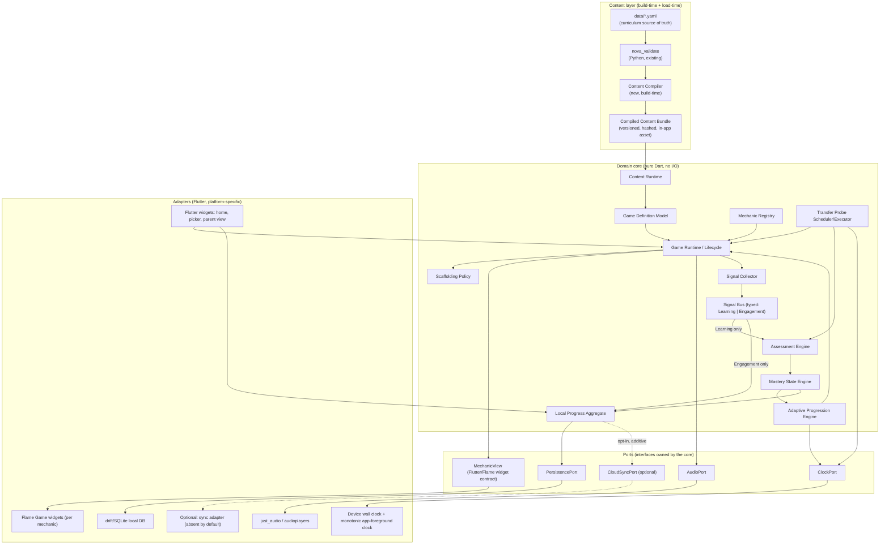
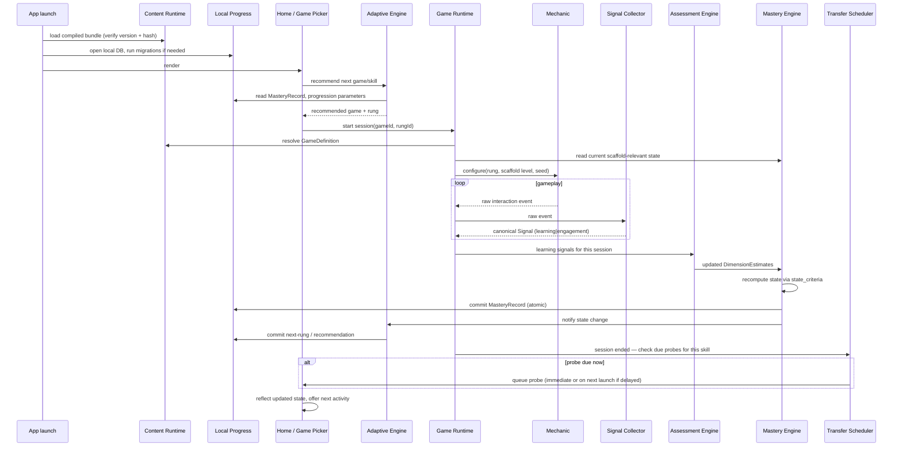
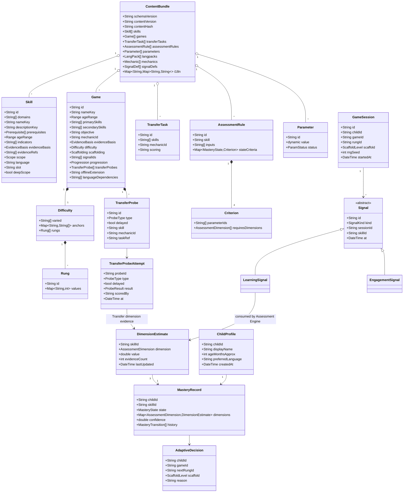
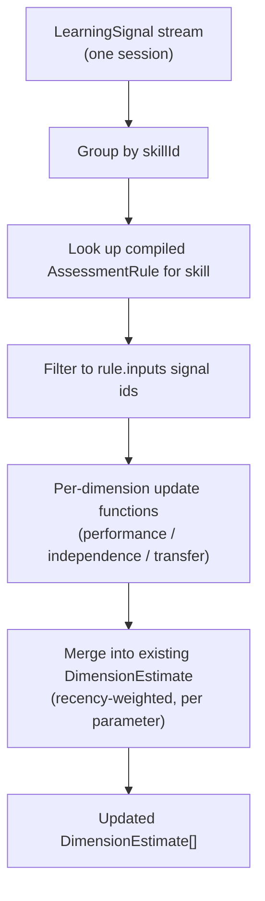
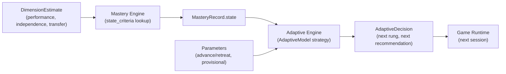
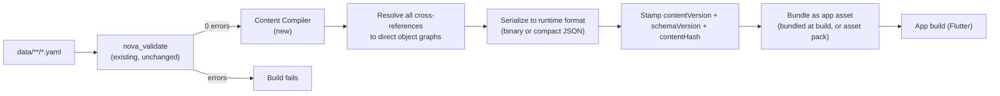
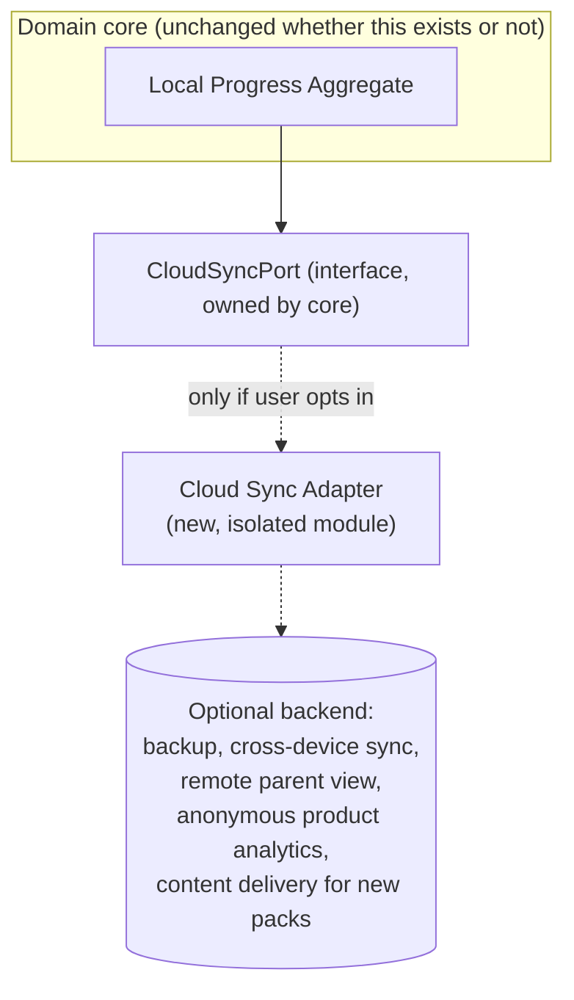

# Nova Game Platform: Technical Design

Date: 2026-09-22
Status: Draft for review
Sub-project: 2 of N (game platform architecture; no app code)
Source of truth consumed: `docs/superpowers/specs/2026-09-21-nova-curriculum-design.md` (rev 2.1), `docs/superpowers/plans/2026-09-21-nova-curriculum-spec.md`, `data/schema/*.schema.json`, `data/**/*.yaml`, `tools/validate/nova_validate/`

## 0. How to read this document

This is a design, not a plan. It fixes the architecture so that a later implementation plan can pick a task order without re-deciding structure. It does not write application code, does not introduce a backend, and does not change the curriculum data model. Section 21 verifies both the server-independence constraint and that the existing schemas are consumable as designed.

Section numbers below map to the twenty items in the design brief; §22 gives an explicit traceability table back to that numbering for anyone auditing coverage.

## 1. Problem restatement and non-negotiables

Nova ships game experiences to children aged 2-8. The curriculum sub-project (rev 2.1, approved) fixed a data model — skills, games, transfer tasks, evidence, parameters, assessment rules, language packs, mechanics, signals, i18n — validated by `tools/validate`. This sub-project designs the runtime that turns that data into play, and turns play back into a mastery state, without ever talking to a server to do either.

Non-negotiable constraints carried forward from the brief:

- The client contains everything needed for content loading, game execution, difficulty progression, scaffolding, signal collection, assessment, mastery computation, adaptive progression, transfer probes and local persistence.
- No game, assessment rule or adaptive rule may require a network round-trip. Sync, backup, analytics, remote parent access and content delivery are optional, additive, and never load-bearing.
- Curriculum data → game definitions → game runtime → signals → assessment → mastery → adaptive progression → local progress is a one-way pipeline. Curriculum knowledge does not leak into rendering code; rendering code does not leak into assessment.
- A game mechanic is reusable across games and skills.
- Assessment rules are data-driven (from `data/assessment/*.yaml`), never hardcoded per game.
- Engagement signals are structurally unreachable from the assessment engine.
- Within-game performance alone can never yield Secure or Transfer; Secure additionally requires Independence evidence, Transfer additionally requires a passed transfer probe. This is enforced by the assessment rule contract (`state_criteria.<state>.requires_dimensions`), not by convention.

## 2. Technology decision

### 2.1 Requirements that drive the choice

The brief asks for an evaluation against: mobile/tablet-first, Android, iOS, web/PWA if appropriate, offline operation, animation, touch interaction, audio, RTL Arabic, accessibility, small-child interaction patterns, asset management, deterministic gameplay/testing, local persistence, future game expansion.

Two of these deserve early emphasis because they eliminate options outright:

- **RTL Arabic is launch content, not a later add-on.** Arabic literacy is one of the four deep-coverage clusters. The runtime needs correct bidi text shaping, letter joining (`data/langpacks/langpacks.yaml`: `script.joining: true`, `script.diacritics: true`), and full UI mirroring, on day one, on every platform.
- **The catalog is many small, custom 2D mini-games sharing reusable mechanics** (`drag-to-count`, `match-symbol-to-quantity`, `catch-target`, `print-hunt`, `physical-counting`, and a growing vocabulary in `data/mechanics.yaml`), not a handful of screens. The technology has to make a mechanic a genuinely reusable unit, not a per-game reimplementation.

### 2.2 Options considered

| Option | Cross-platform reach | Rendering / animation | Touch & gesture | RTL / Arabic text | Accessibility | Offline storage | Deterministic testing | Mechanic reuse | Team/ecosystem cost |
|---|---|---|---|---|---|---|---|---|---|
| **A. Flutter + Flame** | Single codebase → Android, iOS, and web/PWA as a secondary target, from one engine | Skia/Impeller-rendered, identical pixel behaviour on every platform; strong first-class animation (`AnimationController`, `Flame` component/effect system) | Native gesture recognizers, generous hit-testing, built for touch-first | `intl` + built-in bidi text layout, RTL mirroring is a framework feature (`Directionality`), not a plugin | `Semantics` tree maps to platform accessibility APIs (TalkBack/VoiceOver) | `drift`/`sqflite` (typed SQLite), `Hive` for key-value, all local, mature | `flutter_test` + golden-file (pixel) tests; Flame's fixed-timestep loop takes an injectable `Random` seed | Flame `Component`/`Game` classes give a natural mechanic-as-reusable-unit model; Flutter widgets handle chrome | One language (Dart) for game canvas and UI chrome; smaller hiring pool than JS, offset by single codebase |
| **B. React Native + Skia (`react-native-skia`) + Reanimated + Gesture Handler** | Single codebase → Android, iOS; web reach via `react-native-web` is partial (Skia/Reanimated support lags) | Skia-based custom rendering is strong but is a bolted-on layer over RN's own layout system, not the platform's native renderer | Reanimated + Gesture Handler are mature and touch-first | RTL support exists (`I18nManager`) but is a per-component discipline, not automatic; Arabic text shaping depends on the OS text engine via RN's `Text`, historically inconsistent across Android OEMs | Native accessibility props exist but must be applied per component, more manual than Flutter's Semantics tree | `WatermelonDB`/SQLite bindings, mature | JS timing/animation determinism is harder to pin down (event loop, native bridge async) | Custom canvas mechanics are buildable but there is no built-in "game" abstraction; more scaffolding to build ourselves | Large JS/React hiring pool; most familiar to a web-oriented team |
| **C. Native (Kotlin + Jetpack Compose; Swift + SwiftUI), two codebases** | Best possible per-platform fidelity, but literally two implementations of every game and every rule that touches rendering | Best-in-class native animation on each platform | Best-in-class native touch handling | Best native text shaping (ICU/HarfBuzz on both platforms) | Best native accessibility, for free | Room / Core Data + SQLite, mature on each side | Deterministic per platform, but "deterministic across platforms" (same seed → same outcome on iOS and Android) is not guaranteed and must be hand-verified twice | No cross-platform mechanic reuse: a mechanic is reimplemented per OS, directly against the reusability requirement | 2x build cost for every game, indefinitely; not viable for a growing catalog with a small team |
| **D. Web/PWA (TypeScript + Phaser or PixiJS) wrapped for stores via Capacitor** | Single codebase, browser-first, wrapped for app stores | Canvas/WebGL 2D is very capable for this kind of game (Phaser is a real 2D game engine) | Touch works but pointer-event normalization across mobile browsers/webviews needs care | Bidi/CSS `direction: rtl` is solid for DOM UI; in-canvas Arabic text shaping is the weak point — Phaser/PixiJS text rendering does not give correct Arabic joining/diacritics out of the box and would need a custom text-shaping layer (e.g. pre-shaping with HarfBuzz-wasm) | Canvas content is invisible to screen readers by default; an accessible DOM overlay has to be hand-built and kept in sync | IndexedDB (offline-capable but **evictable** under storage pressure on iOS Safari/WebViews, a real risk for irreplaceable child progress data) | Deterministic if disciplined (seeded RNG, fixed-step loop); browser audio/animation timing has more platform variance than a compiled runtime | Phaser's Scene/GameObject model gives mechanic reuse similar in spirit to Flame's | Familiar stack, but the two weakest rows (in-canvas Arabic shaping, storage eviction for progress data) are exactly the two things this product cannot get wrong |

### 2.3 Decision

**Flutter, using the Flame engine for the game canvas and standard Flutter widgets for chrome (home screen, game picker, parent-facing views, settings), Dart throughout.**

Rationale, weighed against the two constraints in §2.1 that eliminate options:

- Option D's canvas-text weakness is disqualifying on its own: Arabic letter joining and diacritics are launch content, and shaping Arabic correctly inside a WebGL/canvas game engine is a real, unsolved-by-default problem, not a configuration flag. Flutter's text layout is bidi- and shaping-aware by default because it goes through the same engine used for all UI text, not a separate game-canvas text renderer.
- Option D's local-storage eviction risk is a second disqualifier: local progress is the *only* copy of a child's mastery history in this architecture (§11), and IndexedDB data can be evicted by the browser under storage pressure, especially in iOS Safari/WKWebView. A compiled app with SQLite-backed storage does not have this failure mode.
- Option C is rejected on the reusability requirement stated in the brief ("a game mechanic should be reusable across multiple games and skills"): two codebases means every mechanic is really two mechanics that must be kept behaviourally identical by discipline alone, and cross-platform deterministic testing (same seed, same outcome, both OSes) is not guaranteed by the platform.
- Option B is the closest competitor. It loses to Flutter on the two things this product leans on hardest: RTL/Arabic text shaping being a framework guarantee rather than a per-component discipline, and a built-in game-loop/animation model (Flame) versus building an equivalent from Reanimated primitives. React Native's web target is also the weaker of the two web stories, which matters less because web is secondary here, but is worth recording.
- Flutter's Semantics tree gives accessibility (§16) largely "for free" per component, which matters for a product whose users are children who may not read yet and parents/caregivers who may use assistive technology.
- Flame sits *inside* Flutter, not beside it: a Flame `Game` widget is embedded in an ordinary Flutter widget tree, so the Game Runtime (§6) can be plain Flutter for anything that is not gameplay canvas (menus, scaffolding prompts, parent reports) and Flame only for the parts that are genuinely animated interactive canvas. This maps directly onto the required data-flow separation in §1: mechanic/canvas code never needs to know about curriculum content, and chrome code never needs to know about game-loop internals.

**Secondary target:** Flutter Web, built from the same codebase, as an optional desktop/parent-preview surface (e.g. a parent reviewing content on a laptop). It is explicitly not a primary child-facing target at launch — mobile/tablet touch is — and it inherits the same server-independence constraint (a static, installable PWA build, not a hosted service the runtime depends on).

**Residual risks accepted and mitigated:**

| Risk | Mitigation |
|---|---|
| Dart/Flutter hiring pool is smaller than JS's | Single codebase and single language reduce the number of engineers needed in the first place; the validator and content pipeline stay in Python regardless (§17), so the team is not all-Dart |
| Flutter Web audio latency and PWA storage limits are less mature than mobile | Web is explicitly secondary (see above); no product requirement depends on web-only capability |
| Flame is a smaller ecosystem than, say, Unity | The catalog is many *small* 2D mechanics (drag, tap, catch, sort, sequence-recall), not a 3D or physics-heavy game; Flame's scope matches the actual need, and pulling in a full game engine (Unity) would add licensing, binary size and Arabic-text-shaping problems of its own (TextMeshPro RTL is a bolted-on plugin, not native) for capability the catalog does not use |

## 3. Architecture overview

Layered, one-directional, ports-and-adapters (hexagonal) architecture. The **domain core** (content runtime, game lifecycle, mechanics, assessment, mastery, adaptive progression, transfer probes) has zero imports of any networking, platform-channel, or UI-framework-specific package. Everything that touches the outside world — rendering, audio, local storage, a future cloud sync — is an **adapter** behind a narrow **port** interface that the core defines and calls, never the reverse.



The load-bearing property of this diagram: delete `SyncPort`/`CloudAdapter` entirely and every other arrow still forms a complete, runnable loop. That is the server-independence constraint expressed structurally, not just as a policy statement (verified in §21).

## 4. Component responsibilities

One responsibility per component, mirroring the discipline already used in `tools/validate/nova_validate` (one rule module per concern, tested in isolation). "Does not" lines are as load-bearing as "does" lines — they are the seams that keep curriculum knowledge out of rendering code and engagement signals out of assessment.

| Component | Does | Does not |
|---|---|---|
| **Content Compiler** (build-time) | Runs `nova_validate` (must report 0 errors), then compiles `data/**/*.yaml` into one versioned, content-hashed bundle (§17) | Run on-device; ship with app logic; skip validation |
| **Content Runtime** | Loads the bundle at app start; builds in-memory id-indices; exposes typed, read-only accessors (`skill(id)`, `game(id)`, `gamesForSkill(id)`, `mechanicsForSkill(id)`, `assessmentRule(skillId)`, `i18n(key, lang)`, …) | Contain game logic, scoring logic, or mutable state |
| **Game Definition Model** | Typed Dart classes that mirror `game.schema.json` / `skill.schema.json` / etc. field-for-field; pure data | Contain behaviour |
| **Mechanic Registry** | Maps `mechanic_id` → a `GameMechanic` implementation; one implementation serves every game that declares that `mechanic_id` | Know which skill or game is using it |
| **Game Runtime / Lifecycle** | Orchestrates one game session end to end (§5): resolves definition, mechanic, current rung, scaffold level; drives the session; hands off at completion | Compute mastery, decide the next rung's *policy* (only executes the rung the Adaptive Engine already chose), or talk to storage directly |
| **Scaffolding Policy** | Given the current `MasteryRecord` + `game.scaffolding` + the relevant parameters, decides hint timing/level and whether to show the adult prompt | Log signals itself (the Game Runtime logs the effect of scaffolding as a signal) |
| **Signal Collector** | Converts a mechanic's raw interaction events into canonical `Signal` records against the `data/signals.yaml` vocabulary; stamps `kind` (`learning`/`engagement`), timestamp, session/skill/game ids | Filter or route signals — that is the bus's job |
| **Signal Bus** | Publishes `Signal`s on two *type-distinct* streams, `Stream<LearningSignal>` and `Stream<EngagementSignal>` | Expose a combined/untyped stream — see §8.2 for why this is the actual enforcement mechanism |
| **Assessment Engine** | Pure, data-driven functions that turn `LearningSignal`s into `DimensionEstimate` updates, per `data/assessment/*.yaml` | Accept an `EngagementSignal` (does not type-check, §8.2); know about specific games or mechanics — only skill ids and dimension semantics |
| **Mastery State Engine** | Combines a skill's `DimensionEstimate`s via that skill's `state_criteria` (from the compiled assessment rule) into a `MasteryRecord`; enforces `requires_dimensions` structurally | Read signals directly (only reads `DimensionEstimate`s) |
| **Adaptive Progression Engine** | Given `MasteryRecord` + progression parameters (`advance_parameter`/`retreat_parameter`) + performance trend, decides the next rung and the next recommended game/skill | Decide mastery state (reads it, does not compute it) |
| **Transfer Probe Scheduler/Executor** | Schedules due `cross_game`/`cross_context`/delayed probes from `game.transfer_probes`; resolves `task_ref` against the union of games and transfer tasks (confirmed in `coverage_rules.py`, §9.3); executes the probe (another game session, or an adult-scored task UI); reports the result as Transfer-dimension evidence | Decide mastery state itself — it only supplies evidence to the Assessment Engine |
| **Local Progress Aggregate** | The single write path for child profiles, dimension estimates, mastery records, signal history, probe attempts, installed content version | Allow any other component to write to storage directly (all writes go through it, all reads may go direct to the `PersistencePort` adapter) |
| **Parent-Facing Progress View** | Reads Local Progress + compiled evidence metadata; applies the reporting rule from spec §3.6 (only "evidence-based" at `empirical` + `moderate`/`strong`, else "informed by"); labels anything from a `provisional` parameter as an estimate | Read raw signals or show engagement metrics as learning evidence |
| **Language & i18n Runtime** | Resolves i18n keys per active language(s); exposes the active langpack's `script` properties to the UI layer | Contain any UI layout logic itself (layout mirroring is delegated to Flutter's own `Directionality`, §14) |
| **Accessibility Layer** | Cross-cutting: semantics labels, TTS narration hooks, large-target layout rules, reduced-motion/caption toggles | Live in a separate module tree — it is a set of requirements every mechanic and screen must satisfy (§16), not a component that runs by itself |
| **CloudSyncPort adapter (optional)** | If present and opted in: reads the Local Progress export format and pushes/pulls it | Ever get called by the domain core directly; only the composition root (app entry point) wires it in |

## 5. Runtime lifecycle



Key lifecycle rules:

1. **Bundle verification precedes everything.** If the installed content bundle's schema/content version is incompatible with what the app build expects, the app refuses to run gameplay and shows an update prompt (§20) rather than run against mismatched data.
2. **A session never commits partial mastery state.** The Assessment → Mastery → Local Progress write in the diagram is one transaction (§11.3); a crash mid-session loses at most the in-progress session's buffered signals, never corrupts a previously-committed `MasteryRecord`.
3. **The Adaptive Engine is consulted, never bypassed.** The Game Runtime does not pick its own starting rung; it is handed one. This is what keeps "within-game performance alone" from silently becoming the adaptive decision-maker.
4. **Transfer probes are evaluated, not just scheduled, entirely locally**, using the device clock via `ClockPort` (§9.4 discusses the integrity caveat this implies).

## 6. Data flow

```mermaid
flowchart LR
    A["data/*.yaml<br/>(source of truth)"] -->|validate + compile| B["Content Bundle"]
    B --> C["Content Runtime<br/>(indices)"]
    C --> D["Game Definition<br/>(per game)"]
    D --> E["Game Runtime"]
    E --> F["Mechanic instance"]
    F -->|raw events| G["Signal Collector"]
    G -->|tagged Signal| H{"kind?"}
    H -->|learning| I["Assessment Engine"]
    H -->|engagement| J["Local engagement log<br/>(product health only)"]
    I --> K["DimensionEstimate"]
    K --> L["Mastery Engine"]
    L --> M["MasteryRecord"]
    M --> N["Adaptive Engine"]
    N --> E
    M --> O["Local Progress Store"]
    O --> P["Parent-Facing View"]
    J -.->|never| I
```



The dotted "never" edge from engagement logs to the Assessment Engine is the structural expression of spec principle 3 / plan constraint "engagement signals must never be usable by the assessment engine" (enforced by the type system, §8.2, not just by this diagram).

This is also the literal shape of the pipeline the brief specifies (curriculum data → game definitions → game runtime → signals → assessment → mastery → adaptive progression → local progress): every arrow in §3, §5 and §6 flows the same direction, and nothing downstream writes back upstream except the Adaptive Engine feeding the *next* Game Runtime session (a new instance, not a mutation of curriculum data or game definitions).

## 7. Domain model



Notes on fields that need explanation beyond the schema:

- **`MasteryRecord` has no `not_yet` literal.** `MASTERY_STATES` in `nova_validate.model` is `(emerging, developing, secure, transfer)`; "Not yet" (spec §3.2) is modelled as *the absence of a `MasteryRecord`* for a `(childId, skillId)` pair, not a fifth enum value. The Mastery Engine must special-case "no record yet" as its own state when the Parent-Facing View or Adaptive Engine asks for a skill's status.
- **`confidence` is not a fourth `requires_dimensions` value.** The assessment-rule schema's `requires_dimensions` enum is exactly `{performance, independence, transfer}` — confidence (spec §3.4: "trial counts, consistency, recency") is a *derived quality* attached to each `DimensionEstimate` and rolled up onto `MasteryRecord.confidence`, not a gate a criterion can require. The Mastery Engine computes it, it does not gate on it (a low-confidence Secure is still Secure, just flagged as low-confidence to the parent view).
- **`TransferProbe.taskRef` is polymorphic.** `coverage_rules.py` resolves it against the union of games and transfer tasks. The Transfer Probe Executor must do the same at runtime: if `taskRef` resolves to a `Game`, executing the probe means starting a real `GameSession` on that game; if it resolves to a `TransferTask`, it means presenting the adult-scored task UI (§9.3). This is not a design choice this document is making — it is already true of the validated data and the runtime must match it.

## 8. Interfaces / contracts

### 8.1 Content Runtime

```dart
abstract class ContentRuntime {
  Skill skill(String id);
  Game game(String id);
  TransferTask? transferTask(String id);
  Object? probeTarget(String taskRef); // Game or TransferTask, per §7
  List<Game> gamesForSkill(String skillId);
  List<TransferTask> tasksForSkill(String skillId);
  AssessmentRule assessmentRuleFor(String skillId);
  Parameter parameter(String id);
  Mechanic mechanic(String id);
  String i18n(String key, String language);
  LangPack langPack(String language);
  String contentVersion;
  String contentHash;
}
```

Every accessor is a lookup into a pre-built index (`Map<String,T>` from the compiled bundle, §17); none of it re-parses YAML or touches disk at call time.

### 8.2 Signal Bus — the actual enforcement of "engagement signals never reach assessment"

```dart
sealed class Signal {
  final String id;
  final String sessionId;
  final String skillId;
  final DateTime at;
}
class LearningSignal extends Signal {
  final String signalDefId;   // must be kind:"learning" in data/signals.yaml
  final Object value;
}
class EngagementSignal extends Signal {
  final String signalDefId;   // must be kind:"engagement"
  final Object value;
}

abstract class SignalBus {
  Stream<LearningSignal> get learningSignals;
  Stream<EngagementSignal> get engagementSignals;
  // No combined/untyped stream is exposed. This is deliberate.
}

abstract class AssessmentEngine {
  // The parameter type is Stream<LearningSignal>. Passing engagementSignals
  // here is a compile error, not a runtime check — the constraint is
  // structural, matching "engagement signals must never be usable by the
  // assessment engine" at the type level, not by a filter someone could
  // forget to apply.
  Future<List<DimensionEstimateUpdate>> ingest(
    Stream<LearningSignal> signals,
    AssessmentRule rule,
    List<Parameter> parameters,
  );
}
```

The `Signal Collector` is the one place that reads `data/signals.yaml`'s `kind` field and decides which subtype to construct; every consumer downstream gets the guarantee for free from the type system. This is the concrete mechanism behind the diagram's dotted "never" edge in §6.

### 8.3 Mastery Engine — structural enforcement of the Secure/Transfer rule

```dart
abstract class MasteryEngine {
  // Recomputes state from ALL currently known dimension estimates for the
  // skill, using that skill's compiled AssessmentRule.state_criteria.
  // A state is only reachable if every dimension its criterion's
  // requires_dimensions lists has a fresh-enough DimensionEstimate.
  // Concretely: `secure` requires {performance, independence} present;
  // `transfer` requires {transfer} present (a passed probe, §9). There is
  // no code path that derives `secure` or `transfer` from `performance`
  // alone, because the criterion lookup itself would find the required
  // dimension missing and refuse to advance past `developing`.
  MasteryRecord recompute({
    required String childId,
    required String skillId,
    required Map<AssessmentDimension, DimensionEstimate> dimensions,
    required AssessmentRule rule,
    required List<Parameter> parameters,
  });
}
```

### 8.4 Adaptive Progression Engine — pluggable model

The curriculum spec (§3.5) explicitly defers "the choice of adaptive model (rule-based, Bayesian knowledge tracing, IRT, or other)" to this sub-project, and states every parameter ships `provisional`. The architecture therefore defines the engine as a swappable strategy, not a fixed algorithm:

```dart
abstract class AdaptiveModel {
  AdaptiveDecision decide({
    required MasteryRecord current,
    required Game game,
    required Parameter advanceParam,   // game.progression.advance_parameter
    required Parameter retreatParam,   // game.progression.retreat_parameter
    required List<DimensionEstimate> recentPerformance,
  });
}

// Launch implementation: a direct, explainable read of the provisional
// advance/retreat parameters against recent performance trend. This is
// deliberately simple and replaceable.
class RuleBasedAdaptiveModel implements AdaptiveModel { ... }

class AdaptiveProgressionEngine {
  AdaptiveProgressionEngine(this.model);
  final AdaptiveModel model; // swap for a future Bayesian/IRT implementation
  AdaptiveDecision recommend(...) => model.decide(...);
}
```

Swapping `RuleBasedAdaptiveModel` for a future model later touches this one seam and nothing else — not the Game Runtime, not the Mastery Engine, not persistence.

### 8.5 Game Mechanic abstraction (§9 expands this)

```dart
abstract class GameMechanic<TConfig, TRawEvent> {
  String get mechanicId; // must match data/mechanics.yaml
  void configure(TConfig config, Rung rung, ScaffoldLevel scaffold, int rngSeed);
  Stream<TRawEvent> get rawEvents;
  Widget buildView(BuildContext context); // Flutter/Flame widget, adapter side
  void dispose();
}

// Supplied per-game, not per-mechanic: turns a mechanic's generic raw
// events into curriculum-meaningful signals. This is what lets one
// mechanic implementation serve many games/skills — the mapping from
// "player dragged item X to slot Y" to "this counts as an accuracy signal
// for skill math.count.cardinality" lives in the Game Definition's data
// (which signal ids it declares, §3.7) plus a small per-game adapter
// function, never inside the mechanic itself.
typedef SignalMapper<TRawEvent> = LearningOrEngagementDraft Function(
  TRawEvent event,
  GameSession session,
);
```

## 9. Game mechanic abstraction, difficulty and scaffolding

### 9.1 Mechanic reusability, concretely

A `GameMechanic` implementation (e.g. `DragToCountMechanic`) knows how to run a drag-and-drop counting interaction, parameterized by `TConfig` (item sprites, target count range, prompt text/audio key) and by a `Rung` (which of the seven difficulty dimensions apply and at what value, per §9.2). It does not know it is being used for `game.math.bear-snacks` versus a hypothetical future `game.math.fruit-basket` reusing the same `mechanic_id: drag-to-count` — both are just different `TConfig` values pulled from their respective `Game` records. This is what makes `data/mechanics.yaml` a real controlled vocabulary rather than a label: adding a new game that reuses `drag-to-count` requires zero new mechanic code, only a new `Game` YAML record, mirroring the plan's Task-E instruction to "add a mechanic only when the interaction genuinely differs from every existing one."

### 9.2 Difficulty model → rung resolution

Each `Game.difficulty.rungs[i].values` is a full vector over all seven `DIFFICULTY_DIMENSIONS`, with `varied` naming which ones actually change across rungs (the rest are fixed at the values the game author chose) and `anchors` giving the human-readable label for every value a varied dimension takes. At runtime:

1. The Adaptive Engine picks a target `Rung` id (§8.4).
2. The Game Runtime resolves that `Rung` from the `Game`'s `difficulty.rungs` list via the Content Runtime.
3. The Mechanic receives the full 7-dimension vector plus the anchor labels for the dimensions it varies, so a mechanic can render an age-appropriate cue for "this is now harder" (e.g. more distractor items) without hardcoding what "harder" means for that skill — the label comes from data.
4. Cognitive load is never treated as the mechanism for raising another dimension: the Game Runtime does not compose or interpolate between rungs; it always presents an author-declared rung as-is, preserving the spec's rule that cognitive load must not confound a rise in another dimension.

### 9.3 Transfer-probe execution

`TransferProbe.taskRef` resolves, per §7's note, to either a `Game` or a `TransferTask`:

- **Resolves to a `Game`:** the Transfer Probe Executor starts an ordinary `GameSession` on that game (with a rung chosen by the same Adaptive Engine, defaulting to a rung near the child's current level for the *probed* skill), and treats its outcome as Transfer-dimension evidence for `probe.skill`, tagged with the probe id, instead of (also) counting toward `probe.skill`'s Performance dimension as ordinary practice would. This distinction matters and is carried on the `TransferProbeAttempt` record, not inferred later.
- **Resolves to a `TransferTask`:** the Executor presents a lightweight, non-game UI matching the task's `scoring` field. Every current `transfer_task` in the data (`data/transfer_tasks/`) uses adult-mediated scoring ("Adult marks each count correct or incorrect in the app" / "...found or not found"), so this UI is a simple, audio-supported prompt plus a two/three-button adult response control — deliberately not styled as a game, so it is not conflated with practice.
- Either way, the result becomes a `TransferProbeAttempt`, fed to the Assessment Engine as Transfer-dimension evidence (never Performance-dimension evidence, even when the probe happens to be "a game").

### 9.4 Delayed probes and clock integrity

Delayed probes are due after an elapsed wall-clock interval (spec §3.4: "provisionally days, not minutes"). The `ClockPort` reads the device's wall clock. Because the device clock is user-adjustable, a delayed probe's timing is **advisory, not tamper-proof**: a child or parent changing the system clock could make a delayed probe fire early or late. Given Nova's claims are explicitly non-clinical (spec principle 6) and a failed delayed probe never demotes state (spec §3.4 — it only lowers confidence and schedules review), this is an accepted, low-consequence risk, not a security boundary; it is recorded here so it is not silently assumed away. Mitigation kept in scope: the scheduler also tracks monotonic app-foreground time as a secondary signal and treats a probe as "due" only when *both* the wall-clock interval and a minimum foreground-session count have elapsed, which dampens (without eliminating) clock manipulation.

### 9.5 Scaffolding

`Scaffolding Policy` is a pure function of `(MasteryRecord for the skill, Game.scaffolding, relevant Parameters)` → `ScaffoldLevel` (e.g. `modelled | guided | hint-on-request | independent`, mirroring the Independence difficulty dimension's anchors in spec §3.3). The Game Runtime asks for a `ScaffoldLevel` before configuring the mechanic and again after each attempt, so scaffolding can step down within a session as the child succeeds, and the *use* of a hint is itself logged as a `learning` signal (`hints_used`, already in `data/signals.yaml`) feeding the Independence dimension — scaffolding is not a UI-only concern, it is assessment input.

## 10. Assessment architecture

The Assessment Engine is a pure, stateless computation over data already validated by `tools/validate`: `check_assessment_rules` guarantees every `AssessmentRule` at load time has all four `state_criteria`, uses only real parameter ids, and (via `coverage_rules`) that every deep-scope skill has one. The runtime engine does not re-implement those guarantees; it trusts the compiled bundle (§17) and focuses purely on turning `LearningSignal`s into `DimensionEstimate`s:



- **Performance** is computed from accuracy/error-type/response-time/retries signals declared in `rule.inputs`, against the accuracy-threshold parameter(s) referenced by the relevant `Criterion.parameters`.
- **Independence** is computed from hint/adult-assist signals; more hints at a given rung lowers Independence regardless of Performance.
- **Transfer** is set *only* by `TransferProbeAttempt` results (§9.3), never by in-game signals, even ones tagged `learning` — this is a second, separate guarantee beyond the learning/engagement split: performance signals from ordinary practice are structurally routed to Performance/Independence, and only a probe attempt can write to Transfer. The `AssessmentEngine.ingest` signature in §8.3 takes a `LearningSignal` stream for ordinary sessions and a distinct `TransferProbeAttempt` for probes; there is no code path that lets a high accuracy score alone set Transfer evidence.
- **Confidence** (§7's note) accumulates from evidence volume, consistency across attempts, and recency decay; it is attached to the `DimensionEstimate`, not gated as a fourth `requires_dimensions` value.

Every numeric threshold this engine reads comes from a `Parameter` record carrying `status: provisional` (or a calibrated status with a linked study, spec §3.5); the engine never hardcodes a cutoff. This is what "assessment rules must be data-driven and must not be hardcoded separately inside individual games" means concretely: a game's YAML declares *which* signals and *which* parameters feed its skills' assessment; the engine and its per-dimension update functions are generic across every skill and game in the catalog.

## 11. Adaptive architecture, mastery, and their relationship



Mastery and Adaptive Progression are deliberately two engines, not one, because they answer different questions: Mastery answers "what does the evidence say the child can do," which must be conservative and dimension-gated (§8.3); Adaptive Progression answers "what should happen next in play," which can be more responsive (e.g. stepping a rung back after two misses within a session, without that alone demoting a `MasteryRecord`). Collapsing them would risk exactly the failure mode the spec rules out: in-game performance quietly becoming sufficient for Secure/Transfer, just laundered through a single combined engine instead of two.

## 12. Local persistence model

### 12.1 Storage choice

`drift` (typed SQLite) as the `PersistencePort` adapter: relational integrity for the graph of `ChildProfile → MasteryRecord → DimensionEstimate history → Signal (learning, retained) / TransferProbeAttempt`, transactional writes, and a mature migration story for schema evolution (§18).

### 12.2 Schema (logical, not a migration script)

| Table | Key content | Notes |
|---|---|---|
| `child_profiles` | id, display name, approximate age, preferred language, created_at | No account, no auth, no server id |
| `mastery_records` | (child_id, skill_id) → state, confidence, updated_at | One current row per skill; history in `mastery_transitions` |
| `mastery_transitions` | child_id, skill_id, from_state, to_state, at, reason | Append-only audit trail, drives the parent view's "recent progress" |
| `dimension_estimates` | child_id, skill_id, dimension, value, evidence_count, last_updated | Recomputed, not append-only (a compact current-state table) |
| `learning_signals` | id, child_id, session_id, skill_id, signal_def_id, value, at | Retained for confidence/recency computation and re-derivation if a future assessment-rule version needs replay (§18.3) |
| `engagement_signals` | id, child_id, session_id, signal_def_id, value, at | Retained locally for product-health review only; **not read by any assessment code path** — enforced by §8.2's type split, not just by this note |
| `probe_attempts` | probe_id, child_id, skill_id, type, delayed, result, scored_by, at | Feeds Transfer dimension exclusively |
| `installed_content` | content_version, content_hash, schema_version, installed_at | Checked at boot (§5, §20) |

### 12.3 Write discipline

All state-changing writes from a completed session (new `DimensionEstimate`s, new `MasteryRecord`, new `AdaptiveDecision`, consumed `learning_signals`) commit in one `drift` transaction. `engagement_signals` writes are independent and best-effort (losing an engagement event on crash is acceptable; losing a mastery update is not).

### 12.4 Export / backup

Local Progress exposes an export function producing a single signed(-optionally) JSON/SQLite-dump file the parent can save wherever they choose (device file system, their own cloud drive, email to themselves) and an import that restores it. This is the whole "backup" story at launch: a user-controlled file, not a Nova-operated server (§20 covers the optional future cloud extension that could automate this).

## 13. Offline model

Nova does not have an "offline mode" as a distinct state to design for — offline is the only mode the domain core knows about. Concretely:

- The Content Bundle is installed with the app (or as an app-store asset pack, §17.3) — never fetched at first run.
- Every port in §3 (`PersistencePort`, `ClockPort`, `AudioPort`, the mechanic `RenderPort`) has exactly one required adapter and it is local. `CloudSyncPort` is the only optional one, and only it may involve a network call.
- The app has no loading spinner that depends on connectivity, no "waiting for server" state, and no feature that silently degrades when offline versus online, because there is no online-only feature to degrade from.
- A network permission is not requested at all for the core app; it is requested lazily and explicitly only when/if a user opts into a future sync capability (§20), so its absence is visible in the platform permission model, not just in code.

## 14. Language architecture (Arabic and English) and future extension

### 14.1 Pack contract at runtime

A `LangPack` (already schema'd: `id`, `script.{direction,joining,diacritics,tonal,notes}`, `slots_filled`, `instruction_voice`, `status`) drives two runtime concerns:

- **Text and UI direction**: `script.direction` selects Flutter's `Directionality` for the whole subtree during an Arabic session — layout mirroring (nav order, icon flipping, RTL scroll) is a framework behaviour once `Directionality` is set correctly, not per-screen logic the team writes and re-writes per mechanic.
- **Content availability**: `slots_filled` tells the Content Runtime which shared literacy slots (`listening`, `vocabulary`, `phonological_awareness`, `print_concepts`, `letter_knowledge`, `sound_mapping`, `word_building`, `early_reading`) this language can serve; a `contract_only` pack (today: `zh`) is visible in data but the game picker never offers it, matching its `status`.

### 14.2 Arabic specifics

`joining: true` and `diacritics: true` are handled by Flutter's text engine (ICU/HarfBuzz-backed shaping), not custom code — this was a load-bearing part of the technology decision in §2.3. Audio narration (spoken instructions, letter names) is data-referenced per i18n key (an audio-asset key alongside the text key, an extension this document flags for the content schema in §14.4 rather than silently adding to it) and ships in the language's asset bundle.

### 14.3 Universal vs. language-specific skills

Per spec §3.1/§3.8, universal skills (math, EF, memory, most domains) need only translated i18n strings and carry no `language`/`slot`. The Content Runtime does not special-case them beyond that — a universal skill's `Game`/`AssessmentRule`/`MasteryRecord` path is identical regardless of the active UI language; only its `name_key`/`description_key` resolution and any spoken-instruction audio differ per language.

### 14.4 Extending to a new language (e.g. Chinese, Hindi)

Adding a language means: (1) a new `LangPack` record moving from `contract_only` toward `complete` as slots are filled with real skill/game content authored under `data/skills/`, `data/games/`, etc. with that `language`; (2) new `i18n/<lang>.yaml`; (3) new audio assets. It does **not** mean touching the Content Runtime, Game Runtime, Assessment Engine, Mastery Engine, or Adaptive Engine — none of those components branch on language identity except the two narrow points in §14.1-14.2 (direction, shaping), which are already generalized (any `script.tonal: true` language, e.g. Chinese, is exactly as representable as Arabic's `joining`/`diacritics`, even though nothing currently consumes `tonal` beyond flagging it for future audio/pinyin-annotation UI work).

**Open flag, not a silent change:** the current `skill`/`game`/`transfer_task` schemas have no audio-asset key field; today's data models only text i18n keys. This document does not add one — that would be changing the established curriculum model outside this design's authority — but flags it here as a concrete, near-term schema addition the next content-authoring pass or implementation plan should raise explicitly, since spoken narration is core to a pre-literate audience and Arabic launch content assumes it.

## 15. Accessibility architecture

Accessibility is treated as a cross-cutting contract every mechanic and screen must satisfy, verified in code review and automated checks, not a bolt-on layer:

- **Semantics**: every interactive element in every `GameMechanic.buildView` carries a `Semantics` label sourced from i18n, so TalkBack/VoiceOver can narrate it; this is a per-mechanic requirement enforced by a shared widget-test helper (§19) rather than left to each mechanic author's discretion.
- **Touch targets**: a shared minimum hit-target size (generously above platform minimums, matching "small-child interaction patterns") is a constant the Mechanic Registry's base class enforces at layout time, not a convention.
- **Audio-first navigation**: since the audience may be pre-literate, every screen's primary actions are icon + spoken-audio, with text as a secondary/parent-facing layer, not the only cue.
- **Reduced motion / captions**: a device-level or in-app toggle the Accessibility Layer exposes to every mechanic via the same `ScaffoldLevel`-style context object, so a mechanic can honor "reduce motion" without knowing why.
- **Color and contrast**: palette constraints (colorblind-safe distractor sets, since `distractors` is a real difficulty dimension whose failure mode should not be "can't see the difference") are a design-system constraint, checked in the same golden-file tests used for rendering regressions.
- **Parent gate, not auth**: settings, external links, and purchase-adjacent screens (if any exist later) sit behind a simple non-literacy-dependent "parent gate" (e.g., a held-button or simple arithmetic prompt), standard practice for child-directed apps and an App Store/Play Store expectation — explicitly not an authentication system (§16 keeps this distinct from any future account concept).

## 16. Security and child-data privacy boundaries

- **No accounts, no auth, by design** — matching §1's constraint that the runtime operates without authentication. `ChildProfile` is a local-only record with no server identity.
- **No third-party SDKs that phone home** by default (no ad SDKs, no third-party analytics network calls) — the only network-capable component in the entire architecture is the optional `CloudSyncPort` adapter (§20), which the composition root does not wire in unless a user opts in.
- **Minimal data collection is structural, not a policy note**: the domain core has no model for anything beyond `displayName`, approximate age, preferred language, and gameplay-derived records — there is no field to accidentally collect more into.
- **At-rest protection**: local DB access is scoped to the app sandbox by the OS on both platforms; encryption-at-rest is deferred as an optional hardening (`sqlcipher`-backed `drift`) rather than a launch requirement, since there is no network exposure to defend against and the primary threat model is "another app or a lost/shared device," not remote compromise.
- **Export files are the one place data leaves the device**, and only at explicit user action (§12.4); the export format documents child data plainly (it is, after all, for the parent) and is never uploaded anywhere by the app itself.
- **Regulatory posture**: COPPA/GDPR-K-style regimes (flagged as an open question in the curriculum spec §7.2) are easier to satisfy by an architecture that collects nothing beyond local, non-identifying gameplay data and never transmits it — this design's default posture (no network, no accounts, no third-party data sharing) is deliberately the conservative starting point so that whichever specific regime applies later, the baseline is already compliant-by-default rather than needing retrofitting.
- **Non-clinical claims boundary**: the Parent-Facing View (§4) is the single place mastery/assessment data is rendered to a human, and it is the enforcement point for spec §3.6's reporting rule (estimate labelling, "evidence-based" only at `empirical`+`moderate`/`strong`) — this is a privacy-adjacent boundary too, in that it is also the only place a claim about a child's development is stated at all; no other component surfaces mastery data directly to a user.

## 17. Content build pipeline



### 17.1 Why a compiler, not a direct YAML read at runtime

`data/**/*.yaml` stays the authoring source of truth, exactly as the brief requires ("the curriculum YAML/JSON remains the source of truth; the runtime consumes compiled/runtime-safe representations of that data"). The app does not parse YAML, run JSON Schema validation, or resolve string-id cross-references at startup on a child's device — that is wasted CPU/battery on low-end tablets for data that is already known-valid at build time. The compiler's job is: run `nova_validate` (fail the build on any error, exactly as CI would), then flatten id-references into direct structural links, then serialize.

### 17.2 Where the compiler lives

A small additional tool, most naturally `tools/build_content/` (Python, alongside `tools/validate`, reusing its `loader`/`model` where possible) or a Dart `build_runner` step invoked from the Flutter build — either is consistent with this design; the choice is a build-tooling decision for the implementation plan, not an architectural one, since both produce the same versioned bundle artifact consumed identically by the Content Runtime.

### 17.3 Asset delivery

At launch, with two complete/near-complete languages (`ar`, `en`), the whole bundle ships inside the app binary — simplest, fully offline from first install, no extra moving parts. As the catalog and language count grow, the same bundle format is compatible with platform on-demand asset delivery (Android Play Asset Delivery / iOS On-Demand Resources) for, e.g., a language pack a user has not selected — this is an app-store distribution mechanism, not a runtime server dependency: once an asset pack is downloaded, gameplay against it is fully offline like everything else, and its *absence* is not required to run the app, only to unlock that specific language.

## 18. Versioning strategy

### 18.1 Two independent version axes

- **`schemaVersion`**: the shape of the compiled bundle format (and, transitively, of `data/schema/*.schema.json`). Bumped only when a schema changes in a way the runtime's typed model must follow.
- **`contentVersion`**: the curriculum content itself (new skills/games/evidence, semver-style: patch for content fixes, minor for additive content, major for anything that changes ids or shapes children have progress against).

### 18.2 Compatibility rule

The app build declares the `schemaVersion` range it understands. At boot (§5), if the installed bundle's `schemaVersion` is outside that range, the app blocks gameplay and prompts an app update rather than attempting to run against a bundle shape it cannot safely interpret — this is the one place "failure" is preferred over "best-effort," because silently misreading a mismatched assessment rule risks exactly the kind of unverified progression claim the spec forbids.

### 18.3 Id stability and local-progress continuity

Skill/game/mechanic/parameter ids are treated as permanent once shipped (matching the plan's id convention, §"Data layout and ids" in the plan). `MasteryRecord`s are keyed by skill id, so a content update that adds skills or games is transparent to existing progress; a content update that would *remove or rename* an id a child already has progress against is the one case local persistence cannot resolve on its own. This document does not solve that by adding a schema field (out of this design's authority, §0), but flags it explicitly as a real gap for the next content-governance pass: either (a) treat id removal/rename as forbidden after ship (an authoring-discipline rule for `data/`, enforceable by a future `nova_validate` check comparing against the previous release's id set), or (b) add a `superseded_by` field later. Recording this here satisfies "if a contradiction is found, document it explicitly instead of silently changing the curriculum" — this is not a contradiction in today's data, but a forward-looking seam the design makes visible rather than discovering it as a production incident.

### 18.4 Assessment-rule replay

Because raw `learning_signals` are retained (§12.2), a future `contentVersion` that only changes an assessment rule's parameters (not its shape) can, if ever desired, recompute historical `DimensionEstimate`s by replaying stored signals through the new rule — this is a capability the persistence model enables by retaining raw signals, not a feature this design commits to building at launch.

## 19. Testing strategy

Mirrors the validator's own discipline (`tests/factory.py` + one test module per rule, §"Conventions" in the plan) inside the client codebase:

| Layer | Approach | Determinism mechanism |
|---|---|---|
| **Content Runtime** | Unit tests against a small fixture bundle (a Dart port of `tests/factory.py`'s `make_spec()` shape) | Pure functions over fixed data; no randomness involved |
| **Mechanics** | Unit tests per mechanic: feed a scripted sequence of simulated touch/drag events, assert the exact `rawEvents` sequence and derived `Signal`s | `GameMechanic.configure` takes an explicit `rngSeed`; the fixed-timestep Flame loop is stepped manually in tests, never wall-clock-driven |
| **Assessment Engine** | Table-driven: given a fixed `LearningSignal` sequence + a fixed `AssessmentRule` + fixed `Parameter`s, assert the exact resulting `DimensionEstimate`s — same spirit as the validator's "copy the fixture, break one thing" pattern | Pure function, no I/O, no clock |
| **Mastery Engine** | Given fixed `DimensionEstimate`s, assert the exact `MasteryState`; explicit negative tests asserting `secure`/`transfer` are unreachable from `performance`-only evidence (a direct executable check of §8.3's guarantee) | Pure function |
| **Adaptive Engine** | Given a fixed `MasteryRecord` + parameters, assert the exact `AdaptiveDecision`; separately, a contract test asserting `AdaptiveModel` is swappable (a fake model plugged into `AdaptiveProgressionEngine` produces exactly its own output, proving no other logic leaks into the engine) | Pure function; `AdaptiveModel` is injected |
| **Transfer scheduling** | Given a fixed `ClockPort` fake and stored `TransferProbeAttempt`/session history, assert exactly which probes are "due" | `ClockPort` is injected/fake in tests, never the real device clock |
| **Widgets / mechanics rendering** | `flutter_test` golden (pixel) tests per mechanic per rung, including at least one RTL-Arabic golden per shared UI chrome screen | Golden images pinned in the repo; CI fails on any pixel diff |
| **Persistence** | In-memory/temp-file `drift` DB per test; migration tests that build a DB at each prior schema version and assert the migration succeeds and preserves data | Fresh DB per test, no shared state |
| **End-to-end** | A small number of full-session integration tests driving a real `GameRuntime` + fake `PersistencePort`/`AudioPort`/`ClockPort` through a scripted play session, asserting the final `MasteryRecord` and `AdaptiveDecision` | All adapters faked; only the domain core is exercised, so this is a fast, deterministic test despite being "end-to-end" |
| **Content bundle round-trip** | A test compiling the real `data/` (or a fixture subset) and asserting the Content Runtime's accessors return exactly the same values the Python `Spec` loader sees, catching compiler drift between the two implementations | Byte/value comparison against `nova_validate`'s own loaded `Spec` |

No test in this strategy depends on wall-clock time, network access, or unseeded randomness — every source of nondeterminism in the runtime (`ClockPort`, RNG seeds, the `AdaptiveModel` strategy, all persistence and audio adapters) is an injected dependency specifically so it can be replaced with a deterministic fake in tests, the same principle Flutter/Flame encourage and that the technology decision in §2 counted as a real requirement.

## 20. Failure and recovery behavior

| Failure | Behavior |
|---|---|
| App crash mid-session | At most the in-progress session's buffered (uncommitted) signals are lost; last-committed `MasteryRecord`/`DimensionEstimate`s are untouched (§12.3's transaction boundary) |
| Corrupted local DB | `PersistencePort` adapter detects failure to open/read on boot; app falls back to a fresh DB and surfaces a clear "progress could not be read" state to the parent view rather than silently fabricating a `MasteryRecord`; if an export backup exists (§12.4) the app offers to restore from it |
| Installed content bundle fails its content-hash check | Treated the same as an incompatible `schemaVersion` (§18.2): gameplay is blocked, update/reinstall is prompted, rather than running against possibly-corrupt curriculum data |
| Mismatched `schemaVersion` | Gameplay blocked; update prompt (§18.2) |
| Device clock manipulated | Bounded, accepted risk affecting only delayed-probe timing, never state demotion (§9.4) |
| Audio asset missing for the active language | Mechanic degrades to visual-only presentation with an on-screen indicator (never silently proceeds as if audio played, since audio instructions are a scaffolding/accessibility channel, not decoration) |
| A skill has no `MasteryRecord` yet (first exposure) | Modeled explicitly as "Not yet" (§7's note), not as an error state or as `emerging` with no evidence |
| Optional `CloudSyncPort` unavailable/offline | No behavior change anywhere else in the app — by construction (§13), since nothing else calls it |

## 21. Future optional cloud boundary

Everything in this section is additive and absent by default; nothing in §3-§20 changes if it is never built.



Candidate future capabilities, all behind this one seam:

- **Backup/sync**: push the same export format from §12.4 to a user's own cloud storage or a Nova-operated store, pull it down on a new device. The domain core's only awareness of this is that `PersistencePort`'s data *could* have been seeded from a sync adapter; it never calls the adapter itself.
- **Remote parent access**: a second device viewing the Parent-Facing View's data — this requires the sync capability above; it is not a separate architectural surface.
- **Anonymous product analytics**: would read from `engagement_signals` only (never `learning_signals` or assessment/mastery data) if ever added, keeping the same learning/engagement boundary that already exists inside the device.
- **Remote content delivery**: shipping new/updated content bundles (§17) over the network instead of only via app-store updates — still consumed through the same Content Compiler → bundle → Content Runtime path; the network only changes *how the bundle file arrives*, not how it is loaded or trusted (content-hash verification, §20, applies identically).

None of these may become a runtime dependency: the acceptance test for any future work here is that the app still fully functions — plays games, assesses, adapts, persists, reports to parents — with the network permission denied and `CloudSyncPort` unimplemented, exactly as it does today.

## 22. Constraint verification

Explicit check against the brief's core architectural constraint and the "does the design satisfy server-independence" requirement:

- [x] **No backend required.** No component in §3 outside `CloudSyncPort`/`CloudAdapter` performs network I/O; those two are optional and unwired by default (§13, §21).
- [x] **No API required.** The only "API" in the system is the in-process port interfaces (§8) between the domain core and its adapters — none of them cross a network boundary in the required configuration.
- [x] **No authentication required.** `ChildProfile` (§7, §16) has no server identity or credential; the "parent gate" (§15) is explicitly not authentication.
- [x] **No network connectivity required.** §13 verified structurally: every required port has exactly one local adapter.
- [x] **No cloud database required.** All persistence is local `drift`/SQLite (§12).
- [x] **No server-side assessment.** The Assessment Engine (§10), Mastery Engine (§8.3, §11), and Adaptive Engine (§8.4, §11) are pure Dart running on-device; §21 confirms no future cloud capability is allowed to become load-bearing for any of them.
- [x] **No server-side adaptive decisions.** Same as above (§8.4).
- [x] **Existing schemas are consumable without a backend.** §17 designs a build-time-only compiler from the existing nine `data/schema/*.schema.json` files and the existing `nova_validate` loader/model, producing a bundle the Content Runtime reads with zero network or server involvement; §7's domain model was built directly from the current schema field sets (verified against the actual files in `data/schema/`, not from memory) with no changes proposed to any of them.
- [x] **No changes to the established curriculum model.** This design proposes zero schema changes. Two forward-looking gaps were found and are documented rather than silently resolved, per the brief's explicit instruction: an audio-asset key is not yet part of any content schema (§14.4), and id removal/rename has no governance rule yet (§18.3). Both are flagged for the next planning pass, not fixed here.

## 23. Traceability: design-brief scope items → sections

| # | Scope item | Primary section(s) |
|---|---|---|
| 1 | Curriculum/content runtime | §4 (Content Runtime, Content Compiler), §17 |
| 2 | Game definition model | §7, §8.1 |
| 3 | Game runtime / lifecycle | §5, §4 |
| 4 | Game mechanics abstraction | §8.5, §9.1 |
| 5 | Difficulty system | §9.2 |
| 6 | Scaffolding system | §9.5 |
| 7 | Learning-signal collection | §4 (Signal Collector/Bus), §8.2 |
| 8 | Assessment engine | §10, §8.3 |
| 9 | Mastery-state engine | §8.3, §11 |
| 10 | Adaptive progression | §8.4, §11 |
| 11 | Transfer-probe execution | §9.3, §9.4 |
| 12 | Local persistence | §12 |
| 13 | Offline behavior | §13 |
| 14 | Arabic and English language packs | §14.1-14.3 |
| 15 | Future language extension | §14.4 |
| 16 | Accessibility | §15 |
| 17 | Parent-facing local progress | §4 (Parent-Facing Progress View), §12.4, §16 |
| 18 | Content/version management | §17, §18 |
| 19 | Testing strategy | §19 |
| 20 | Security and child-data privacy | §16 |
| — | Technology decision (required, brief §"Technology decision") | §2 |
| — | Future optional cloud boundary (required output item) | §21 |
| — | Failure/recovery behavior (required output item) | §20 |
| — | Server-independence verification (required before finalizing) | §22 |

## 24. What this design deliberately leaves open for the implementation plan

- Whether the Content Compiler is a Python tool beside `nova_validate` or a Dart `build_runner` step (§17.2) — either satisfies this architecture.
- The exact `RuleBasedAdaptiveModel` formula (§8.4) beyond "reads `advance_parameter`/`retreat_parameter` against recent performance" — the parameters are provisional by spec design (§3.5) and the model is explicitly swappable.
- Concrete UI visual design for chrome screens (home, picker, parent view) — this document fixes structure and contracts, not visual design, which is a separate design pass.
- Audio-asset key addition to the content schemas, and an id-stability/governance rule (§18.3) — both flagged, neither decided here, since deciding them is a curriculum-model change outside this document's authority.
- The specific first-party or self-hosted service (if any) behind a future `CloudSyncPort` adapter (§21) — out of scope until a cloud sub-project is chartered.
